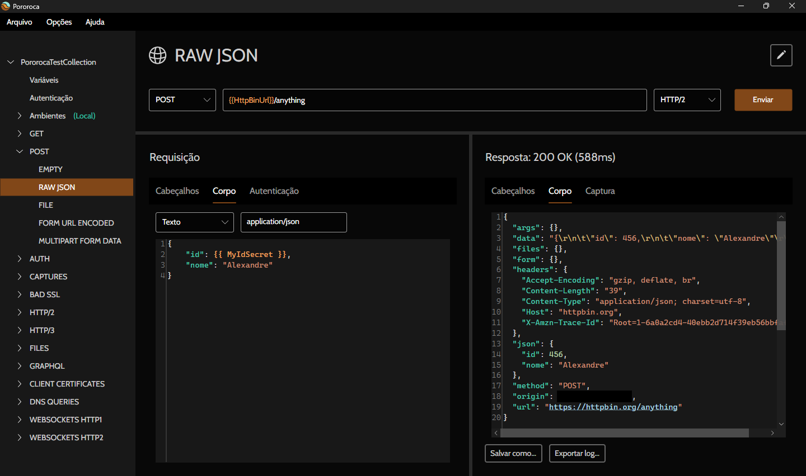

<h1>Pororoca </h1>

Ler em: [english](README.md) | [русском](README_ru.md) | [italiano](README_it.md) | [中文](README_zh-cn.md) | [Deutsch](README_de.md) | [español](README_es.md) | [polski](README_pl.md) | [ไทย](README_th.md)

Pororoca é uma ferramenta de testes de HTTP, como o Postman, mas com diversas melhorias.

Está disponível para Windows, macOS e Linux.

## Instalação

Leia as [instruções](https://pororoca.io/pt/docs/installation) e baixe o programa [aqui](https://github.com/alexandrehtrb/Pororoca/releases).

## Funcionalidades

* Suporte a [HTTP/2](https://http2.github.io/) e [HTTP/3](https://developers.cloudflare.com/http3/).
* Ambientes dentro de coleções.
* Gerenciamento fácil de variáveis.
* Variáveis secretas.
* Coleções e ambientes podem ser exportados juntos em um mesmo arquivo.
* Compatibilidade total com o Postman ao importar ou exportar.
* Consumo muito menor de memória - duas a três vezes menos do que o Postman.
* Suporte a vários idiomas.
* WebSockets, em HTTP/1.1 e HTTP/2.
* Testes automatizados.
* Inicialização rápida.
* Gratuito e código-aberto.

Confira a [documentação](https://pororoca.io/pt/docs/) para saber mais.

*Nota*: No Windows, suporte ao HTTP/2 requer Windows 10 ou acima. Suporte ao HTTP/3 requer Linux ou Windows 11 e acima.

### HTTP/2 e HTTP/3

Quer entender mais sobre HTTP/2 e HTTP/3? Confira este [artigo](https://alexandrehtrb.github.io/posts/2024/03/http2-e-http3-explicados/).

## Política de proteção de dados

O Pororoca não sincroniza dados de usuário, como preferências, coleções, ambientes, informações da máquina ou telemetria, a qualquer servidor remoto. Preferências de usuário e coleções são salvas em arquivo na máquina local.

O Pororoca atende às exigências de segurança da [HIPAA](https://www.stedi.com/blog/postman-is-probably-not-hipaa-compliant).

## Design

Logo e arte criados por [Anderson Martins](https://www.behance.net/am-dsgn).

## Contribuindo

Você pode contribuir com esse projeto através de pull requests, abrindo issues, reportando bugs e sugerindo melhorias. Divulgue o Pororoca para seus amigos se você gostar dele!

Leia [aqui](CONTRIBUTING.md) o tutorial sobre como contribuir com o código e desenvolver localmente.

Entre em contato se desejar suporte mais avançado, customizações especiais ou treinamentos.

## Doações

Doações em dinheiro nos ajudam a continuar o desenvolvimento e cobrir despesas. Leia mais no nosso [anúncio](https://github.com/alexandrehtrb/Pororoca/discussions/159)!

Nossos canais de doação são:

- [OpenCollective](https://opencollective.com/pororoca)
- [GitHub Sponsors](https://github.com/sponsors/alexandrehtrb)
- [Wise](https://wise.com/pay/me/alexandrehenriquet2) (tag: **@alexandrehenriquet2**)
- PIX 🇧🇷 (chave: <b>alexandrehtrb@outlook.com</b>)

## Contato

* Criador: Alexandre H. T. R. Bonfitto
* E-mail: <a href="mailto:%61%6C%65%78%61%6E%64%72%65%68%74%72%62%40%6F%75%74%6C%6F%6F%6B%2E%63%6F%6D" target="_blank" rel="noreferrer">alexandrehtrb@outlook.com</a>
