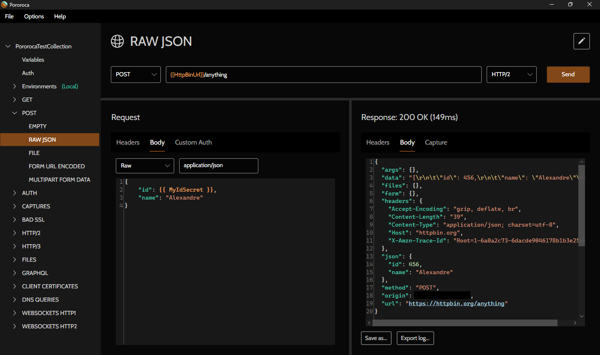

<h1>Pororoca </h1>

Şu dilde okuyun: [english](README.md) | [português](README_pt.md) | [русском](README_ru.md) | [italiano](README_it.md) | [中文](README_zh-cn.md) | [Deutsch](README_de.md) | [español](README_es.md) | [polski](README_pl.md) | [ไทย](README_th.md)

Pororoca, Postman'dan ilham alan ancak birçok iyileştirme sunan bir HTTP test aracıdır.

Windows, macOS ve Linux için kullanılabilir.

## Kurulum

[Kurulum talimatlarını](https://pororoca.io/docs/installation) okuyun ve programı [buradan](https://github.com/alexandrehtrb/Pororoca/releases) indirin.

## Özellikler

* [HTTP/2](https://http2.github.io/) ve [HTTP/3](https://developers.cloudflare.com/http3/) desteği.
* Koleksiyon kapsamlı ortamlar.
* Kolay değişken yönetimi.
* Gizli değişkenler.
* Koleksiyonlar ve ortamlar tek bir dosyada birlikte dışa aktarılabilir.
* Postman ile tam dışa ve içe aktarma uyumluluğu.
* Çok daha düşük bellek kullanımı - Postman'dan iki ila üç kat daha az.
* Çoklu dil desteği.
* HTTP/1.1 ve HTTP/2 üzerinden WebSocket'ler.
* Otomatik test.
* Hızlı başlatma süresi.
* Ücretsiz ve açık kaynaklı.

Daha fazlasını öğrenmek için [belgelere](https://pororoca.io/docs/) göz atın.

*Not*: Windows'ta HTTP/2 desteği için Windows 10 veya üzeri gereklidir. HTTP/3 desteği için Linux veya Windows 11 ve üzeri gereklidir.

### HTTP/2 ve HTTP/3

HTTP/2 ve HTTP/3 hakkında daha fazla bilgi edinmek ister misiniz? Bu [makaleye](https://alexandrehtrb.github.io/posts/2024/03/http2-and-http3-explained/) göz atın.

## Veri koruma politikası

Pororoca; tercihler, koleksiyonlar, ortamlar, makine bilgileri veya telemetri gibi kullanıcı verilerini hiçbir uzak sunucuyla senkronize etmez. Kullanıcı tercihleri ve koleksiyonları, kullanıcının makinesinde dosya olarak saklanır.

Uygulamamız [HIPAA uyumludur](https://www.stedi.com/blog/postman-is-probably-not-hipaa-compliant).

## Tasarım

Logo ve grafikler [Anderson Martins](https://www.behance.net/am-dsgn) tarafından oluşturulmuştur.

## Katkıda bulunma

Pull request'ler göndererek, issue'lar açarak, hataları bildirerek ve iyileştirmeler önererek bu projeye katkıda bulunabilirsiniz. Beğendiyseniz arkadaşlarınıza Pororoca'dan bahsedin!

Kod katkıları ve geliştirme için [buradaki](CONTRIBUTING.md) rehberi okuyun.

Daha gelişmiş destek, özel özelleştirmeler veya eğitim arıyorsanız bizimle iletişime geçin.

## Bağışlar

Maddi bağışlar, projenin geliştirilmesine devam etmemize ve masraflarımızı karşılamamıza yardımcı olur. [Duyurumuzda](https://github.com/alexandrehtrb/Pororoca/discussions/159) daha fazlasını okuyun!

Bağış kanallarımız:

- [OpenCollective](https://opencollective.com/pororoca)
- [GitHub Sponsors](https://github.com/sponsors/alexandrehtrb)
- [Wise](https://wise.com/pay/me/alexandrehenriquet2) (etiket: **@alexandrehenriquet2**)
- PIX 🇧🇷 (anahtar: <b>alexandrehtrb@outlook.com</b>)

## İletişim

* Oluşturan: Alexandre H. T. R. Bonfitto
* E-posta: <a href="mailto:%61%6C%65%78%61%6E%64%72%65%68%74%72%62%40%6F%75%74%6C%6F%6F%6B%2E%63%6F%6D" target="_blank" rel="noreferrer">alexandrehtrb@outlook.com</a>
